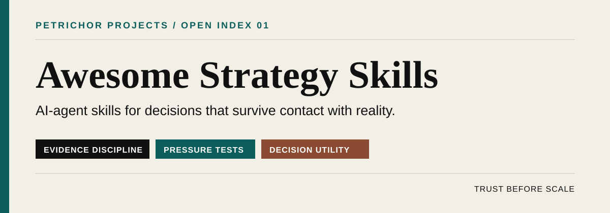

# Awesome Strategy Skills 

<!--lint disable awesome-list-item awesome-toc double-link table-cell-padding table-pipe-alignment-->

> Curated AI-agent skills for decisions that survive contact with reality.

Market research, positioning, product, go-to-market, pricing, growth, and executive operating systems—reviewed for evidence discipline, decision utility, and maintenance. Not a scrape. Not a prompt dump.

**[Browse by outcome](#browse-by-outcome)** · **[Run the Resilience Stack](https://petrichorgrowth.com/resilience-stack?utm_source=github&utm_medium=referral&utm_campaign=awesome-strategy-skills)** · **[Nominate a skill](https://github.com/petrichorprojects/awesome-strategy-skills/issues/new?template=nominate-skill.yml)**

## Contents

- [Start here](#start-here)
- [Featured Petrichor original](#featured-petrichor-original)
- [Browse by outcome](#browse-by-outcome)
  - [Customer and market intelligence](#customer-and-market-intelligence)
  - [Positioning and competitive strategy](#positioning-and-competitive-strategy)
  - [Product and portfolio strategy](#product-and-portfolio-strategy)
  - [Go-to-market and growth](#go-to-market-and-growth)
  - [Pricing and monetization](#pricing-and-monetization)
  - [Executive decisions and operating systems](#executive-decisions-and-operating-systems)
  - [Measurement and experimentation](#measurement-and-experimentation)
  - [Execution systems](#execution-systems)
- [Collections and discovery](#collections-and-discovery)
- [How curation works](#how-curation-works)
- [Safety](#safety)
- [Contributing](#contributing)
- [About Petrichor](#about-petrichor)

## Start here

| If you are… | Start with… | Why |
|---|---|---|
| A founder under pressure | [Skill Compass](https://github.com/petrichorprojects/resilience-stack/tree/main/meta-skills/skill-compass), [Reality Audit](https://github.com/petrichorprojects/resilience-stack/tree/main/skills/diagnostic/reality-audit), and [Scenario War Room](https://github.com/alirezarezvani/claude-skills/tree/main/c-level-advisor/skills/scenario-war-room) | Select the right diagnostic, separate facts from internal belief, then model compound risk. |
| A positioning or brand lead | [Relevancy Audit](https://github.com/petrichorprojects/resilience-stack/tree/main/skills/positioning/relevancy-audit), [Positioning Craft](https://github.com/menkesu/awesome-pm-skills/tree/main/positioning-craft), and [Customer Research](https://github.com/coreyhaines31/marketingskills/tree/main/skills/customer-research) | Connect current market truth to a differentiated position. |
| A product leader | [Strategy Frameworks](https://github.com/menkesu/awesome-pm-skills/tree/main/strategy-frameworks), [Continuous Discovery](https://github.com/menkesu/awesome-pm-skills/tree/main/continuous-discovery), and [Prioritization Craft](https://github.com/menkesu/awesome-pm-skills/tree/main/prioritization-craft) | Move from evidence to choices to an executable product portfolio. |
| A GTM leader | [Marketing Plan](https://github.com/coreyhaines31/marketingskills/tree/main/skills/marketing-plan), [Competitive Intelligence](https://github.com/alirezarezvani/claude-skills/tree/main/c-level-advisor/skills/competitive-intel), and [Pricing Authority Diagnostic](https://github.com/petrichorprojects/resilience-stack/tree/main/skills/growth/pricing-authority-diagnostic) | Join market evidence, coordinated execution, and monetization. |
| A board or investor-facing leader | [Investor Story Forensics](https://github.com/petrichorprojects/resilience-stack/tree/main/skills/investor/investor-story-forensics), [Board Narrative Alignment](https://github.com/petrichorprojects/resilience-stack/tree/main/skills/investor/board-narrative-alignment), and [CEO Advisor](https://github.com/alirezarezvani/claude-skills/tree/main/c-level-advisor/skills/ceo-advisor) | Pressure-test claims before stakeholders or diligence teams do it for you. |

## Featured Petrichor original

### [Resilience Stack](https://github.com/petrichorprojects/resilience-stack)

**18 evidence-demanding strategy frameworks for positioning that holds under pressure.** Each skill converts a Petrichor Projects workshop into an executable agent workflow with explicit prerequisites, adversarial questions, scored diagnostics, and concrete deliverables.

The five flagship kits include evaluation cases, worked examples, scoring rubrics, board-brief formatters, case studies, and launch assets:

- [Competitive Narrative Stress Test](https://github.com/petrichorprojects/resilience-stack/tree/main/skills/positioning/competitive-narrative-stress-test) - Tests whether a competitive story survives adversarial scrutiny.
- [Investor Story Forensics](https://github.com/petrichorprojects/resilience-stack/tree/main/skills/investor/investor-story-forensics) - Cross-examines investor claims against the evidence diligence will demand.
- [Pricing Authority Diagnostic](https://github.com/petrichorprojects/resilience-stack/tree/main/skills/growth/pricing-authority-diagnostic) - Finds where pricing power is eroding before lagging metrics expose it.
- [Relevancy Audit](https://github.com/petrichorprojects/resilience-stack/tree/main/skills/positioning/relevancy-audit) - Detects when positioning is solving yesterday's problem.
- [Revenue Story Audit](https://github.com/petrichorprojects/resilience-stack/tree/main/skills/growth/revenue-story-audit) - Reconciles the revenue story with the mechanics beneath it.

<strong>See all 18 Resilience Stack frameworks</strong>

| Track | Skill | Core question |
|---|---|---|
| Positioning | [Relevancy Audit](https://github.com/petrichorprojects/resilience-stack/tree/main/skills/positioning/relevancy-audit) | Is the company still the answer to the question its market is asking? |
| Positioning | [Positioning Under Pressure](https://github.com/petrichorprojects/resilience-stack/tree/main/skills/positioning/positioning-under-pressure) | Does the position hold when the market shifts? |
| Positioning | [Competitive Narrative Stress Test](https://github.com/petrichorprojects/resilience-stack/tree/main/skills/positioning/competitive-narrative-stress-test) | Can the competitive story survive scrutiny? |
| Diagnostic | [Reality Audit](https://github.com/petrichorprojects/resilience-stack/tree/main/skills/diagnostic/reality-audit) | What is demonstrably true, and what does the team merely believe? |
| Brand | [False Familiarity](https://github.com/petrichorprojects/resilience-stack/tree/main/skills/brand/false-familiarity) | Does the market know the company or only recognize it? |
| Brand | [Brand as Memory System](https://github.com/petrichorprojects/resilience-stack/tree/main/skills/brand/brand-as-memory-system) | How does the brand actually live in customer memory? |
| Brand | [Legacy Brand Relevance Reset](https://github.com/petrichorprojects/resilience-stack/tree/main/skills/brand/legacy-brand-relevance-reset) | When does heritage become a strategic constraint? |
| Brand | [Brand Permission Boundaries](https://github.com/petrichorprojects/resilience-stack/tree/main/skills/brand/brand-permission-boundaries) | What is the market willing to let the brand become? |
| Growth | [Revenue Story Audit](https://github.com/petrichorprojects/resilience-stack/tree/main/skills/growth/revenue-story-audit) | Does the revenue narrative match the underlying mechanics? |
| Growth | [Pricing Authority Diagnostic](https://github.com/petrichorprojects/resilience-stack/tree/main/skills/growth/pricing-authority-diagnostic) | Does pricing signal authority or spreadsheet compromise? |
| Market definition | [Category Creation Pressure Test](https://github.com/petrichorprojects/resilience-stack/tree/main/skills/market-definition/category-creation-pressure-test) | Is the company creating a viable category or merely claiming one? |
| Market definition | [TAM Lie Detector](https://github.com/petrichorprojects/resilience-stack/tree/main/skills/market-definition/tam-lie-detector) | Is the addressable market evidenced or rounded up? |
| Intelligence | [Competitive Blind Spot Mapping](https://github.com/petrichorprojects/resilience-stack/tree/main/skills/intelligence/competitive-blind-spot-mapping) | What does the company fail to see that competitors can see? |
| Intelligence | [Signal vs. Noise Audit](https://github.com/petrichorprojects/resilience-stack/tree/main/skills/intelligence/signal-vs-noise-audit) | Which market signals deserve a response? |
| Intelligence | [Customer Truth Extraction](https://github.com/petrichorprojects/resilience-stack/tree/main/skills/intelligence/customer-truth-extraction) | What do customers believe versus what the company assumes? |
| Investor | [Investor Story Forensics](https://github.com/petrichorprojects/resilience-stack/tree/main/skills/investor/investor-story-forensics) | Does the investor narrative survive forensic examination? |
| Investor | [Board Narrative Alignment](https://github.com/petrichorprojects/resilience-stack/tree/main/skills/investor/board-narrative-alignment) | Is the board hearing the same story as the market? |
| Investor | [Exit Narrative Architecture](https://github.com/petrichorprojects/resilience-stack/tree/main/skills/investor/exit-narrative-architecture) | Does the company story survive an acquirer's scrutiny? |

> **Maintainer disclosure:** Resilience Stack is created and maintained by Petrichor Projects, the maintainer of this list. It earns featured placement because it is the list's reference implementation for evidence discipline and adversarial strategy work. It is evaluated under the same published criteria as external entries. The stack is licensed CC BY 4.0.

**[Explore the repository](https://github.com/petrichorprojects/resilience-stack)** · **[Take a three-minute diagnostic](https://petrichorgrowth.com/resilience-stack?utm_source=github&utm_medium=referral&utm_campaign=awesome-strategy-skills&utm_content=featured)**

## Browse by outcome

Status labels mean:

- **Petrichor Original** — Created by the list maintainer; ownership is disclosed.
- **Reviewed** — Source, scope, instructions, maintenance, and license were manually inspected.
- **Collection** — A useful discovery source; individual entries are not automatically endorsed.

### Customer and market intelligence

- [Competitive Intelligence](https://github.com/alirezarezvani/claude-skills/tree/main/c-level-advisor/skills/competitive-intel) - Builds a recurring competitor-tracking system that feeds positioning, sales, and roadmap decisions. **Reviewed · MIT**.
- [Competitor Profiling](https://github.com/coreyhaines31/marketingskills/tree/main/skills/competitor-profiling) - Produces structured, source-traceable competitor profiles from live market evidence. **Reviewed · MIT**.
- [Continuous Discovery](https://github.com/menkesu/awesome-pm-skills/tree/main/continuous-discovery) - Establishes weekly customer contact, opportunity mapping, and assumption testing. **Reviewed · MIT**.
- [Customer Research](https://github.com/coreyhaines31/marketingskills/tree/main/skills/customer-research) - Extracts jobs, pains, triggers, objections, and customer language from primary and public sources. **Reviewed · MIT**.
- [Jobs-to-be-Done Building](https://github.com/menkesu/awesome-pm-skills/tree/main/jtbd-building) - Uses push, pull, anxiety, and habit forces to uncover the progress customers seek. **Reviewed · MIT**.

### Positioning and competitive strategy

- [Positioning Craft](https://github.com/menkesu/awesome-pm-skills/tree/main/positioning-craft) - Applies an alternatives-first positioning process to define category, value, and best-fit customers. **Reviewed · MIT**.
- [Product Marketing](https://github.com/coreyhaines31/marketingskills/tree/main/skills/product-marketing) - Builds shared positioning, audience, competitive, and messaging context for downstream marketing work. **Reviewed · MIT**.
- [Strategy Frameworks](https://github.com/menkesu/awesome-pm-skills/tree/main/strategy-frameworks) - Structures where-to-play and how-to-win choices using established strategy frameworks. **Reviewed · MIT**.

### Product and portfolio strategy

- [Prioritization Craft](https://github.com/menkesu/awesome-pm-skills/tree/main/prioritization-craft) - Makes roadmap trade-offs explicit with RICE, ICE, Kano, and value-versus-effort models. **Reviewed · MIT**.
- [Strategic PM](https://github.com/menkesu/awesome-pm-skills/tree/main/strategic-pm) - Connects product activity to outcomes, company choices, and a longer strategic horizon. **Reviewed · MIT**.

### Go-to-market and growth

- [Content Strategy](https://github.com/coreyhaines31/marketingskills/tree/main/skills/content-strategy) - Designs searchable and shareable content pillars around business and audience needs. **Reviewed · MIT**.
- [Launch](https://github.com/coreyhaines31/marketingskills/tree/main/skills/launch) - Plans coordinated product and feature launches across audiences, channels, and phases. **Reviewed · MIT**.
- [Marketing Loops](https://github.com/coreyhaines31/marketingskills/tree/main/skills/marketing-loops) - Replaces isolated campaigns with compounding acquisition and distribution systems. **Reviewed · MIT**.
- [Marketing Plan](https://github.com/coreyhaines31/marketingskills/tree/main/skills/marketing-plan) - Produces an executable, resource-aware GTM roadmap across the customer lifecycle. **Reviewed · MIT**.

### Pricing and monetization

- [Pricing](https://github.com/coreyhaines31/marketingskills/tree/main/skills/pricing) - Frames packaging, value metrics, willingness to pay, and price-point decisions. **Reviewed · MIT**.
- [Pricing Strategist](https://github.com/alirezarezvani/claude-skills/tree/main/commercial/skills/pricing-strategist) - Combines pricing-model selection, Van Westendorp analysis, and tier design without pretending to output an oracle number. **Reviewed · MIT**.

### Executive decisions and operating systems

- [CEO Advisor](https://github.com/alirezarezvani/claude-skills/tree/main/c-level-advisor/skills/ceo-advisor) - Supports executive choices across vision, capital allocation, culture, boards, and investors. **Reviewed · MIT**.
- [Change Management](https://github.com/alirezarezvani/claude-skills/tree/main/c-level-advisor/skills/change-management) - Adapts ADKAR to strategy pivots, reorganizations, process changes, and rollout resistance. **Reviewed · MIT**.
- [Company OS](https://github.com/alirezarezvani/claude-skills/tree/main/c-level-advisor/skills/company-os) - Compares and implements operating rhythms, accountability systems, scorecards, and issue resolution. **Reviewed · MIT**.
- [Decision Logger](https://github.com/alirezarezvani/claude-skills/tree/main/c-level-advisor/skills/decision-logger) - Separates raw board discussion from approved decisions and tracks commitments over time. **Reviewed · MIT**.
- [Scenario War Room](https://github.com/alirezarezvani/claude-skills/tree/main/c-level-advisor/skills/scenario-war-room) - Models cascading, multi-variable risk across finance, revenue, product, people, and operations. **Reviewed · MIT**.
- [Strategic Alignment](https://github.com/alirezarezvani/claude-skills/tree/main/c-level-advisor/skills/strategic-alignment) - Finds broken strategy cascades, conflicting goals, silo optimization, and orphan work. **Reviewed · MIT**.

### Measurement and experimentation

- [A/B Testing](https://github.com/coreyhaines31/marketingskills/tree/main/skills/ab-testing) - Defines hypotheses, variants, success metrics, and decision rules for controlled experiments. **Reviewed · MIT**.
- [Analytics](https://github.com/coreyhaines31/marketingskills/tree/main/skills/analytics) - Builds a measurement plan tied to decisions rather than vanity reporting. **Reviewed · MIT**.
- [Metrics Frameworks](https://github.com/menkesu/awesome-pm-skills/tree/main/metrics-frameworks) - Selects North Star, leading, lagging, and lifecycle metrics around delivered customer value. **Reviewed · MIT**.
- [OKR Frameworks](https://github.com/menkesu/awesome-pm-skills/tree/main/okr-frameworks) - Turns strategic intent into measurable quarterly outcomes and alignment mechanisms. **Reviewed · MIT**.

### Execution systems

- [Superpowers](https://github.com/obra/superpowers) - Adds disciplined brainstorming, planning, execution, verification, and review workflows to coding agents. **Reviewed · MIT**.

## Collections and discovery

Collections help you search beyond this editorial shortlist. Their inclusion does not endorse every item they contain.

- [Agent Skills by Anthropic](https://github.com/anthropics/skills) - Official examples and reference implementations for the Agent Skills format. **Collection**.
- [Awesome Agent Skills](https://github.com/VoltAgent/awesome-agent-skills) - Large cross-platform directory with official and community sources. **Collection**.
- [Awesome PM Skills](https://github.com/menkesu/awesome-pm-skills) - Product-management skills spanning discovery, strategy, metrics, influence, and execution. **Collection · MIT**.
- [Claude Skills](https://github.com/alirezarezvani/claude-skills) - Broad business, executive, commercial, engineering, and operational skill library. **Collection · MIT**.
- [Marketing Skills](https://github.com/coreyhaines31/marketingskills) - Marketing skill library covering research, positioning, GTM, acquisition, monetization, and retention. **Collection · MIT**.
- [Petrichor Marketing Skills](https://github.com/petrichorprojects/marketingskills) - Petrichor's public fork of the Marketing Skills library. **Collection · MIT**.
- [Resilience Stack](https://github.com/petrichorprojects/resilience-stack) - Petrichor's 18 evidence-demanding strategy diagnostics and workshop frameworks. **Collection · CC BY 4.0**.

## How curation works

An entry must do more than contain the word “strategy.” We look for:

1. **A consequential decision** — The skill helps a user choose, prioritize, diagnose, or commit.
2. **Evidence discipline** — It distinguishes facts, assumptions, inference, and missing inputs.
3. **A bounded workflow** — Activation conditions, exclusions, steps, and completion criteria are clear.
4. **Decision-grade outputs** — The result can be reviewed, challenged, and acted on.
5. **Pressure testing** — Trade-offs, counterarguments, failure modes, or adversarial checks are present.
6. **Safety and limits** — The skill does not hide uncertainty or impersonate evidence it does not have.
7. **Reproducibility** — Another operator can understand how the output was produced.
8. **Maintenance and licensing** — Ownership, license, source, and a viable maintenance signal are visible.

Read the full [editorial policy](EDITORIAL-POLICY.md) and the evolving [Petrichor Strategy Skill Index rubric](evaluation/RUBRIC.md). The machine-readable [catalog](data/catalog.json) records review dates, status, category, source, and license.

We optimize for trust per entry, not total entry count. Inclusion can be reversed when a project becomes stale, unsafe, misleading, or strategically generic.

## Safety

Agent skills can contain executable scripts and instructions that affect files, systems, data, or external services. A link on this list is not a security audit.

- Read the complete skill and every bundled script before installation.
- Inspect requested permissions, tools, network access, and data flows.
- Test with non-sensitive data in a sandbox or disposable environment.
- Pin versions when using skills in consequential or repeatable workflows.
- Treat external content as untrusted input and watch for prompt injection.

See [SECURITY.md](SECURITY.md) for reporting and review practices.

## Contributing

Know a strategy skill that belongs here? Read [CONTRIBUTING.md](CONTRIBUTING.md), then [nominate it](https://github.com/petrichorprojects/awesome-strategy-skills/issues/new?template=nominate-skill.yml) or open a pull request.

Maintainers, authors, and commercial sponsors may nominate their own work. Self-interest must be disclosed; inclusion cannot be purchased.

## About Petrichor

[Petrichor Projects](https://petrichorgrowth.com?utm_source=github&utm_medium=referral&utm_campaign=awesome-strategy-skills&utm_content=about) is a strategy consultancy that turns what is true about a company into a position the market can understand, trust, and repeat.

We maintain this list because the quality of AI-assisted strategy depends less on fluent output than on the evidence, pressure tests, and decision architecture behind it.

**[Run a Resilience Stack diagnostic](https://petrichorgrowth.com/resilience-stack?utm_source=github&utm_medium=referral&utm_campaign=awesome-strategy-skills&utm_content=footer)** · **[Work with Petrichor](https://petrichorgrowth.com/contact?utm_source=github&utm_medium=referral&utm_campaign=awesome-strategy-skills&utm_content=footer)**

The curation and original list content are dedicated to the public domain under [CC0 1.0](LICENSE). Linked projects retain their own licenses. Resilience Stack content remains licensed under CC BY 4.0 in its source repository.
